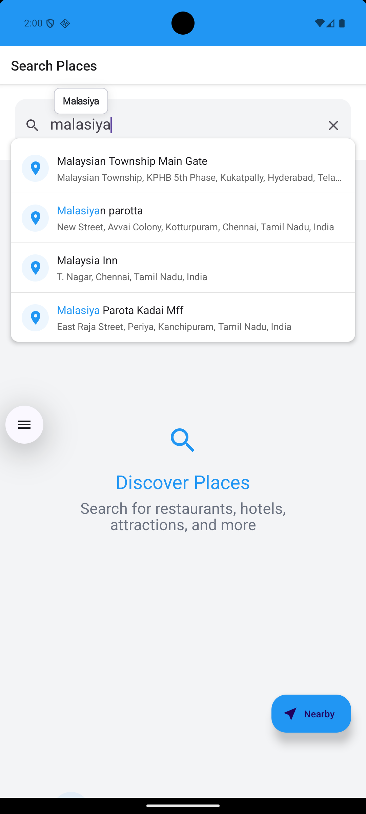

# Pinzy - Location-Based Search App

Pinzy is a React Native mobile application that helps users discover and explore places around them. The app provides features for searching locations, viewing nearby places, and saving favorite locations.

## Features

- 🔍 Search for places using Google Places API
- 📍 View your current location
- 🗺️ Discover nearby places
- 📱 Interactive map interface
- 💾 Save search history
- 🌐 Location-based recommendations
- 🎯 Detailed place information

## Screenshots

<div align="center">
  
  
  
  
  
</div>

## Prerequisites

Before you begin, ensure you have the following installed:

- Node.js (>= 16)
- npm or yarn
- React Native development environment set up
- iOS Simulator (for iOS development)
- Android Studio and Android SDK (for Android development)

## Installation

1. Clone the repository:

```bash
git clone [your-repository-url]
cd pinzy
```

2. Install dependencies:

```bash
npm install
# or
yarn install
```

3. Install iOS dependencies (iOS only):

```bash
cd ios
pod install
cd ..
```

4. Set up environment variables:
   Create a `.env` file in the root directory and add your Google Places API key:

```
GOOGLE_PLACES_API_KEY=your_api_key_here
```

## Running the App

### iOS

```bash
npm run ios
# or
yarn ios
```

### Android

```bash
npm run android
# or
yarn android
```

## Project Structure

```
src/
├── components/     # Reusable UI components
├── navigation/     # Navigation configuration
├── screens/        # Screen components
├── services/       # API and other services
└── utils/         # Utility functions and constants
```

## Dependencies

### Main Dependencies

- React Native
- React Navigation
- React Native Paper
- React Native Maps
- React Native Geolocation Service
- Google Places API
- AsyncStorage

### Development Dependencies

- TypeScript
- ESLint
- Prettier
- Jest

## Contributing

1. Fork the repository
2. Create your feature branch (`git checkout -b feature/AmazingFeature`)
3. Commit your changes (`git commit -m 'Add some AmazingFeature'`)
4. Push to the branch (`git push origin feature/AmazingFeature`)
5. Open a Pull Request

## License

This project is licensed under the MIT License - see the LICENSE file for details.

## Acknowledgments

- Google Places API for location data
- React Native community for the amazing tools and libraries
- All contributors who have helped shape this project

## Support

If you encounter any issues or have questions, please open an issue in the repository.

## Roadmap

- [ ] Add user authentication
- [ ] Implement place reviews and ratings
- [ ] Add offline support
- [ ] Implement place sharing
- [ ] Add more detailed place information
- [ ] Implement place categories and filters
