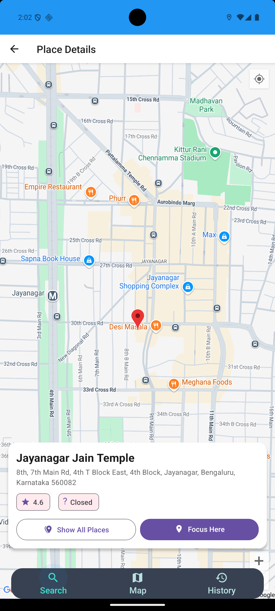

# Pinzy Search App

A React Native application for searching and discovering places using the Google Places API.

## Features

- Search for places using Google Places API
- View place details and location on map
- Save search history
- View nearby places
- Responsive design for all screen sizes
- Dark mode support

## Screenshots

### Home Screen


_Search for places and view nearby locations_

### Home Screen


_Search List locations_

### Map View


_View place details and location on the map_

### History


_View your search history_

## Prerequisites

- Node.js (v14 or higher)
- npm or yarn
- React Native CLI
- Xcode (for iOS development)
- CocoaPods (for iOS dependencies)
- Android Studio (for Android development)
- Google Places API key

## Installation

1. Clone the repository:

```bash
git clone https://github.com/yourusername/pinzy-search-app.git
cd pinzy-search-app
```

2. Install dependencies:

```bash
npm install
# or
yarn install
```

3. Install iOS dependencies:

```bash
cd ios
pod install
cd ..
```

4. Create a `.env` file in the root directory and add your Google Places API key:

```
GOOGLE_PLACES_API_KEY=your_api_key_here
```

## iOS Setup

1. Install Xcode from the Mac App Store
2. Install CocoaPods:

```bash
sudo gem install cocoapods
```

3. Open the iOS project in Xcode:

```bash
cd ios
open PinzySearchApp.xcworkspace
```

4. In Xcode:

   - Select your development team in Signing & Capabilities
   - Update the Bundle Identifier if needed
   - Enable location services in Info.plist:
     - Add `NSLocationWhenInUseUsageDescription` with a description
     - Add `NSLocationAlwaysAndWhenInUseUsageDescription` with a description

5. Install pods:

```bash
pod install
```

6. Run the app:

```bash
# From the root directory
npm run ios
# or
yarn ios
```

## Android Setup

1. Install Android Studio
2. Set up Android SDK and environment variables
3. Create a new Android Virtual Device (AVD)
4. Enable location services in AndroidManifest.xml:

   - Add `ACCESS_FINE_LOCATION` permission
   - Add `ACCESS_COARSE_LOCATION` permission

5. Run the app:

```bash
npm run android
# or
yarn android
```

## Development

Start the development server:

```bash
npm start
# or
yarn start
```

## Building for Production

### iOS

1. Open the project in Xcode
2. Select Product > Archive
3. Follow the distribution steps in Xcode

### Android

1. Generate a signing key
2. Configure the signing in `android/app/build.gradle`
3. Run:

```bash
cd android
./gradlew assembleRelease
```

## Project Structure

```
src/
├── components/     # Reusable UI components
├── screens/        # Screen components
├── navigation/     # Navigation configuration
├── services/       # API and other services
├── utils/         # Utility functions
├── types/         # TypeScript type definitions
```

## Dependencies

- React Native
- React Navigation
- React Native Paper
- React Native Maps
- React Native Vector Icons
- React Native Geolocation Service
- React Native Permissions
- React Native Environment Info
- React Native Config

## Contributing

1. Fork the repository
2. Create your feature branch
3. Commit your changes
4. Push to the branch
5. Create a Pull Request

## License

This project is licensed under the MIT License - see the LICENSE file for details.

## Acknowledgments

- Google Maps Platform
- React Native community
- React Navigation
- React Native Paper

## Support

If you encounter any issues or have questions, please open an issue in the repository.

## Roadmap

- [ ] Add user authentication
- [ ] Implement place reviews and ratings
- [ ] Add offline support
- [ ] Implement place sharing
- [ ] Add more detailed place information
- [ ] Implement place categories and filters
